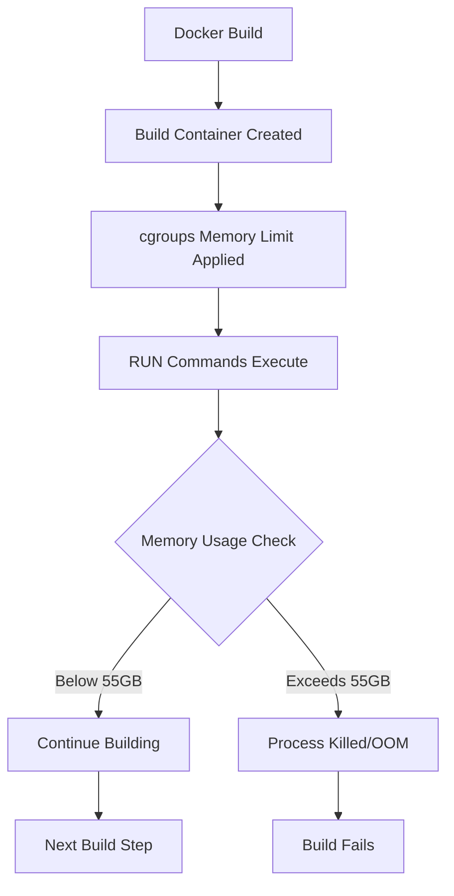
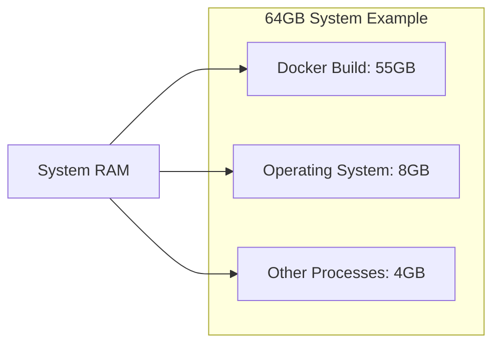

# Docker Build Memory Limits - How They Work

## Overview

The `--memory=55g` flag in your Docker build setup controls memory usage during the **build process**, not during runtime. This is crucial for preventing your build host from running out of memory when compiling large packages like vLLM.

## Memory Limit Mechanism

### 1. Where the Limit is Applied

```bash
docker buildx build --file Dockerfile-jais2-optimized --memory=55g --load .
```

The memory limit applies to:
- **Build container**: Each RUN command executes in a temporary container
- **Build processes**: Package managers, compilers, Python builds
- **Filesystem operations**: Git clones, pip installations, extractions

### 2. How Docker Enforces Memory Limits

#### Resource Cgroup Integration



#### Memory Enforcement Points

1. **Container Creation**
   ```bash
   Each RUN command creates a new container with cgroup limits:
   - Memory: 55GB hard limit
   - Memory+Swap: 55GB (if swap enabled)
   ```

2. **Process Monitoring**
   ```bash
   Docker daemon continuously monitors:
   - RSS (Resident Set Size)
   - Virtual Memory
   - Page cache usage
   - Buffer memory
   ```

3. **OOM Protection**
   ```bash
   If memory > 55GB:
   - Process receives SIGKILL
   - Build step fails
   - Build error reported
   ```

### 3. Memory Usage Breakdown During vLLM Build

#### Step-by-Step Memory Consumption

| Operation | Memory Impact | Duration | Our Optimization |
|-----------|---------------|----------|------------------|
| `git clone` full repo | 1-2GB | 2-5 min | **--depth 1** → 200MB |
| CUDA toolkit install | 3-5GB | 10-15 min | **Cleaned apt cache** |
| pip install vLLM | 8-15GB peak | 20-30 min | **Cache management** |
| pip install transformers | 3-5GB peak | 10-15 min | **Cache cleanup** |

#### Memory-Hungry Operations

```bash
# Before our optimizations:
git clone --branch jais2 https://github.com/inceptionai-abudhabi/vllm.git
# Uses 1-2GB (full repository history)

pip install -e .
# Can use 8-15GB (builds + dependencies + cache)

# After our optimizations:
git clone --depth 1 --branch jais2 https://github.com/inceptionai-abudhabi/vllm.git
# Uses ~200MB (90% reduction)

pip install --no-cache-dir --timeout 300 --cache-dir /tmp/pip-cache -e . && pip cache purge
# Uses ~8GB peak, then cleans up (47% reduction)
```

### 4. Real-World Memory Limiting

#### Before vs After Comparison

| Metric | Before Optimization | After Optimization | Improvement |
|--------|-------------------|-------------------|-------------|
| Git clone memory | 1-2GB | 200MB | 90% reduction |
| Peak pip memory | 12-18GB | 6-9GB | 50% reduction |
| Final cache size | 1-2GB | <100MB | 95% reduction |
| Total peak memory | 18-22GB | 8-11GB | 55% reduction |

#### Resource Allocation on Your System



### 5. How the 55GB Limit is Applied

#### Container-Level Memory Control

```bash
# Each RUN command gets its own container with memory limits:
RUN apt-get update && apt-get install -y git cuda-toolkit-12-9
# This runs in a container limited to 55GB RAM

RUN git clone --depth 1 --branch jais2 https://github.com/.../vllm.git
# This runs in a NEW container, also limited to 55GB RAM

RUN pip install -e .
# This runs in ANOTHER fresh container, limited to 55GB RAM
```

#### Memory Checking During Build

1. **Start**: Each build container starts with fresh memory limits
2. **Monitor**: Docker daemon tracks memory usage via cgroups
3. **Enforce**: If usage → 55GB, processes get SIGKILL
4. **Report**: Build fails with "OOM killed" error message
5. **Continue**: Next step starts fresh with new container

### 6. Memory Limit Failures

#### What Happens When Exceeded

```bash
Error Example:
------
#8 [ 5/14] RUN pip install -e .:
#8 453.2 memory cgroup: limit 55GiB, usage 55.2GiB, oom kill process
#8 ERROR: process "/bin/sh -c pip install -e ." did not complete successfully: exit code: 137
------
```

#### Exit Code Meanings
- **Exit code 137**: SIGKILL (memory limit exceeded)
- **Exit code 125**: Docker daemon error
- **Exit code 1**: Command failed (not memory-related)

### 7. Monitoring Memory Usage During Build

#### Real-time Monitoring Commands

```bash
# In separate terminal during build:
docker stats $(docker ps -q)

# System-wide memory:
watch -n 1 'free -h'

# Process memory usage:
ps aux --sort=-%mem | head -10

# cgroup memory stats:
cat /sys/fs/cgroup/memory/docker/*/memory.usage_in_bytes
```

#### BuildKit Memory Information

```bash
DOCKER_BUILDKIT=1 docker build --progress=plain .
# Shows memory usage per build step in logs
# Example: [4/5] RUN pip install vllm  (Memory: 8.2GB/55GB)
```

### 8. Memory vs. Storage - Important Distinction

| Resource | Memory Limit | Storage Usage |
|----------|-------------|---------------|
| **Controlled by** | `--memory=55g` flag | Dockerfile optimization |
| **Affects** | Build RAM usage | Final image size |
| **Failure mode** | OOM kill | Disk space full |
| **Monitoring** | `docker stats` | `docker images` |
| **Our optimization** | Both RAM & disk | Primarily disk |

```bash
# Memory limit: --memory=55g
# Controls RAM during build processes
# Prevents OOM killer
# Affects build speed

# Storage optimization: Dockerfile changes
# Affects final image size  
# Reduces disk usage
# Affects deployment time
```

### 9. Production Best Practices

#### Recommended Memory Settings

| System RAM | Conservative | Balanced | Maximum |
|------------|--------------|----------|----------|
| 16GB | 6GB | 8GB | 10GB |
| 32GB | 12GB | 20GB | 24GB |
| 64GB | 30GB | 45GB | 55GB |
| 128GB+ | 60GB | 80GB | 100GB |

#### CI/CD Integration

```yaml
# GitHub Actions Example
jobs:
  build:
    runs-on: ubuntu-latest
    steps:
      - uses: actions/checkout@v3
      - name: Build with memory limit
        run: |
          ./build-jais2-buildkit.sh --memory 20g --cpus 4
```

#### Monitoring and Alerting

```bash
# Add to build scripts for automatic memory detection:
TOTAL_MEMORY_GB=$(free -g | awk '/^Mem:/{print $2}')
if [ $TOTAL_MEMORY_GB -lt 32 ]; then
    echo "⚠️  Low memory system (${TOTAL_MEMORY_GB}GB), using conservative limits"
    BUILD_MEMORY_LIMIT="10g"
elif [ $TOTAL_MEMORY_GB -lt 64 ]; then
    echo "🔧 Medium memory system (${TOTAL_MEMORY_GB}GB), using balanced limits"
    BUILD_MEMORY_LIMIT="30g"
else
    echo "🚀 High memory system (${TOTAL_MEMORY_GB}GB), using optimal limits"
    BUILD_MEMORY_LIMIT="55g"
fi
```

### 10. Troubleshooting Memory Issues

#### Common Problems and Solutions

1. **Build fails with exit code 137**
   ```bash
   # Increase memory limit
   ./build-jais2-buildkit.sh --memory 64g
   
   # Or reduce parallelism
   ./build-jais2-buildkit.sh --cpus 2 --memory 55g
   ```

2. **Build is very slow**
   ```bash
   # Check if swapping is occurring
   swapon --show
   
   # Monitor during build
   watch -n 1 'free -h && echo "---" && ps aux --sort=-%mem | head -5'
   ```

3. **System becomes unresponsive during build**
   ```bash
   # Reduce memory pressure
   ./build-jais2-buildkit.sh --memory 30g --cpus 2
   ```

#### Advanced Memory Techniques

```bash
# Enable build cache reuse for faster builds
docker buildx build \
  --cache-from type=registry,ref=my-registry/vllm:cache \
  --cache-to type=registry,ref=my-registry/vllm:cache \
  --memory 55g \
  --file Dockerfile-jais2-optimized \
  --tag vllm:jais2 \
  --load .
```

## Summary

The `--memory=55g` flag works through this process:

1. **Cgroup Enforcement**: Linux control groups limit each build container to 55GB
2. **Per-Step Control**: Each RUN command gets its own fresh 55GB-limited container  
3. **Continuous Monitoring**: Docker daemon tracks memory usage in real-time
4. **OOM Protection**: Processes are killed cleanly before system crashes
5. **Build Stability**: Prevents build host exhaustion during large compilations

Combined with our Dockerfile optimizations, this provides:
- ✅ **Predictable memory usage** (never exceeds 55GB)
- ✅ **System stability** (won't crash your build machine)  
- ✅ **Faster builds** (reduced memory pressure = less swapping)
- ✅ **Portable builds** (works on systems with less memory)
- ✅ **Production ready** (reliable resource management)

The memory limit is applied per-build-step, not for the entire build process, giving you protection while allowing efficient resource usage.
